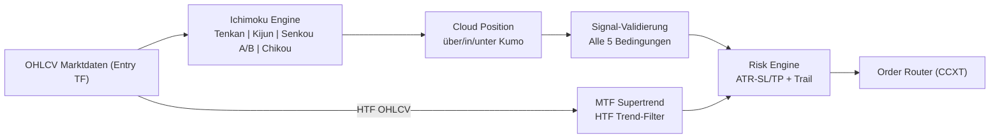

# 🚀 UTBot2 - Universal Trading Bot v2

<div align="center">


[](https://www.python.org/)
[](https://github.com/ccxt/ccxt)
[](LICENSE)

**Ein universeller, flexibler Trading-Bot mit Ichimoku Cloud Indicator und Multi-Timeframe Supertrend Filter für maximale Adaptivität**

[Features](#-features) • [Installation](#-installation) • [Konfiguration](#-konfiguration) • [Live-Trading](#-live-trading) • [Pipeline](#-interaktives-pipeline-script) • [Monitoring](#-monitoring--status) • [Wartung](#-wartung)

</div>

---

## 📊 Übersicht

UTBot2 ist die zweite Generation eines universellen Trading-Bots mit maximaler Flexibilität und Anpassungsfähigkeit. Das System nutzt die komplette Ichimoku Kinko Hyo Indikator-Suite (alle 5 Komponenten) mit Multi-Timeframe Supertrend-Filter für konsistente Performance über verschiedenste Marktbedingungen.

### 🧭 Trading-Logik (Kurzfassung)
- **Vollständiger Ichimoku**: Alle 5 Komponenten (Tenkan-sen, Kijun-sen, Senkou A, Senkou B, Chikou Span) für maximale Signalqualität
- **Cloud-Strategie**: Preis-Position zur Kumo (Wolke) ist Basis für Trendrichtung und Entry-Punkte
- **Supertrend MTF-Filter**: Übergeordneter Timeframe via Supertrend-Indikator filtert nur Trades in Richtung des HTF-Trends
- **Multi-Asset Core**: Parallele Strategien je Symbol/Timeframe mit gemeinsamer Risk-Engine
- **Risk Layer**: ATR-basiertes SL/TP, optionales Trailing; Position Sizing auf Konto-Risk begrenzt
- **Optimizer Loop**: Optuna sucht Ichimoku- und Supertrend-Parameter; Ergebnisse werden als Configs pro Symbol gespeichert
- **Execution**: CCXT für Order-Platzierung mit realistischer Slippage-Simulation

### 🔍 Strategie-Visualisierung


### 📈 Vollständiges Ichimoku-Signal

**LONG-Bedingungen (alle müssen erfüllt sein):**
1. ✅ Preis über der Kumo (Wolke = Senkou A/B)
2. ✅ Tenkan-sen > Kijun-sen (Momentum)
3. ✅ Chikou Span über historischem Preis UND historischer Wolke
4. ✅ Zukunftswolke ist bullish (Senkou A > Senkou B)
5. ✅ Preis über Tenkan-sen (schnelle EMA)
6. ✅ HTF Supertrend ist BULLISH

**SHORT-Bedingungen (alle müssen erfüllt sein):**
1. ✅ Preis unter der Kumo
2. ✅ Tenkan-sen < Kijun-sen
3. ✅ Chikou Span unter historischem Preis UND historischer Wolke
4. ✅ Zukunftswolke ist bearish (Senkou A < Senkou B)
5. ✅ Preis unter Tenkan-sen
6. ✅ HTF Supertrend ist BEARISH

### 📊 Trade-Beispiel (TP/SL/Trailing)
- **Setup**: Alle 5 Ichimoku-Bedingungen bullish + HTF Supertrend grün → Long-Signal
- **Entry**: Bei Signalbestätigung zum Close-Preis mit Telegram-Alert
- **Initial SL**: ATR-Multiplikator × ATR unter Entry (mindestens 0.5%)
- **TP**: SL-Distanz × Risk-Reward-Ratio (Default: 2.0)
- **Trailing**: Nach Erreichen des Activation-RR wird der SL nachgezogen unter letzte Higher Low

---

## 🚀 Features

### Trading Features
- ✅ Ichimoku Kinko Hyo komplette Implementierung (5 Komponenten)
- ✅ Supertrend Multi-Timeframe Filter (HTF-Bias)
- ✅ 7+ Kryptowährungspaare gleichzeitig (BTC, ETH, SOL, DOGE, XRP, ADA, AAVE)
- ✅ Multiple Timeframes (15m, 30m, 1h, 6h, 1d)
- ✅ Dynamisches Position Sizing basierend auf ATR
- ✅ ATR-basiertes Stop-Loss und Take-Profit Management
- ✅ Trailing Stop Management mit Activation-RR
- ✅ Automatische Trade-Verwaltung
- ✅ Telegram-Benachrichtigungen

### Technical Features
- ✅ CCXT Integration für mehrere Börsen
- ✅ Ichimoku Cloud Indikatoren (vollständig)
- ✅ Supertrend Indikator für MTF-Filtering
- ✅ ATR für dynamisches Risk Management
- ✅ Optuna Hyperparameter-Optimierung
- ✅ Backtesting mit realistischer Slippage-Simulation
- ✅ Walk-Forward-Analyse
- ✅ Performance-Tracking und Reporting

---

## 📋 Systemanforderungen

### Hardware
- **CPU**: Multi-Core Prozessor empfohlen
- **RAM**: Minimum 4GB, empfohlen 8GB+
- **Speicher**: 2GB freier Speicherplatz

### Software
- **OS**: Linux (Ubuntu 20.04+), macOS, Windows 10/11
- **Python**: Version 3.8 oder höher
- **Git**: Für Repository-Verwaltung

---

## 💻 Installation

### 1. Repository klonen

```bash
git clone https://github.com/Youra82/utbot2.git
cd utbot2
```

### 2. Automatische Installation (empfohlen)

```bash
# Linux/macOS
chmod +x install.sh
./install.sh

# Windows (PowerShell)
python -m venv .venv
.venv\Scripts\activate
pip install -r requirements.txt
```

Das Installations-Script führt folgende Schritte aus:
- ✅ Erstellt eine virtuelle Python-Umgebung (`.venv`)
- ✅ Installiert alle erforderlichen Abhängigkeiten
- ✅ Erstellt notwendige Verzeichnisse (`data/`, `logs/`, `artifacts/`)
- ✅ Initialisiert Konfigurationsdateien
- ✅ Ladet historische Daten für Ichimoku-Berechnung

### 3. API-Credentials konfigurieren

Erstelle eine `secret.json` Datei im Root-Verzeichnis:

```json
{
  "utbot2": [
    {
      "name": "Binance Trading Account",
      "exchange": "binance",
      "apiKey": "DEIN_API_KEY",
      "secret": "DEIN_SECRET_KEY",
      "options": {
        "defaultType": "future"
      }
    }
  ]
}
```

⚠️ **Wichtig**: 
- Niemals `secret.json` committen oder teilen!
- Verwende nur API-Keys mit eingeschränkten Rechten (Nur Trading, keine Withdrawals)
- Aktiviere IP-Whitelist auf der Exchange

### 4. Trading-Strategien konfigurieren

Bearbeite `settings.json` für deine gewünschten Handelspaare:

```json
{
  "live_trading_settings": {
    "active_strategies": [
      {
        "symbol": "BTC/USDT:USDT",
        "timeframe": "6h",
        "higher_timeframe": "1d",
        "use_supertrend_filter": true,
        "active": true
      },
      {
        "symbol": "ETH/USDT:USDT",
        "timeframe": "4h",
        "higher_timeframe": "1d",
        "use_supertrend_filter": true,
        "active": true
      }
    ]
  }
}
```

**Parameter-Erklärung**:
- `symbol`: Handelspaar (Format: BASE/QUOTE:SETTLE)
- `timeframe`: Einstiegs-Timeframe
- `higher_timeframe`: Multi-Timeframe Filter Timeframe
- `use_supertrend_filter`: Supertrend-Filter aktivieren (true/false)
- `active`: Strategie aktiv (true/false)

---

## 🔴 Live Trading

### Start des Live-Trading

```bash
# Master Runner starten (verwaltet alle aktiven Strategien)
python master_runner.py
```

### Manuell starten / Cronjob testen
Ausführung sofort anstoßen (ohne auf den 15-Minuten-Cron zu warten):

```bash
cd /home/ubuntu/utbot2 && /home/ubuntu/utbot2/.venv/bin/python3 /home/ubuntu/utbot2/master_runner.py
```

Der Master Runner:
- ✅ Lädt Konfigurationen aus `settings.json`
- ✅ Berechnet Ichimoku-Signale für Entry-Timeframe
- ✅ Berechnet Supertrend für Higher-Timeframe (Bias-Filter)
- ✅ Startet separate Prozesse für jede aktive Strategie
- ✅ Überwacht Kontostand und verfügbares Kapital
- ✅ Managed Positionen und Risk-Limits
- ✅ Loggt alle Trading-Aktivitäten
- ✅ Sendet Telegram-Benachrichtigungen für neue Signale

### Automatischer Start (Produktions-Setup)

Richte den automatischen Prozess für den Live-Handel ein.

```bash
crontab -e
```

Füge die folgende **eine Zeile** am Ende der Datei ein. Passe den Pfad an, falls dein Bot nicht unter `/home/ubuntu/utbot2` liegt.

```
# Starte den UTBot2 Master-Runner alle 15 Minuten
*/15 * * * * /usr/bin/flock -n /home/ubuntu/utbot2/utbot2.lock /bin/sh -c "cd /home/ubuntu/utbot2 && /home/ubuntu/utbot2/.venv/bin/python3 /home/ubuntu/utbot2/master_runner.py >> /home/ubuntu/utbot2/logs/cron.log 2>&1"
```

*(Hinweis: `flock` ist eine gute Ergänzung, um Überlappungen zu verhindern, aber für den Start nicht zwingend notwendig.)*

Logverzeichnis anlegen:

```bash
mkdir -p /home/ubuntu/utbot2/logs
```


---

## 📊 Interaktives Pipeline-Script

Das **`run_pipeline.sh`** Script automatisiert die Parameter-Optimierung für deine Handelsstrategien. Es führt Optuna-basierte Hyperparameter-Suche durch und findet die optimalen Ichimoku- und Supertrend-Einstellungen.

### Features des Pipeline-Scripts

✅ **Interaktive Eingabe** - Einfache Menü-Navigation  
✅ **Automatische Datumswahl** - Zeitrahmen-basierte Lookback-Berechnung  
✅ **Optuna-Optimierung** - Bayessche Hyperparameter-Suche  
✅ **Ladebalken** - Visueller Fortschritt mit tqdm  
✅ **Batch-Optimierung** - Mehrere Symbol/Timeframe-Kombinationen  
✅ **Automatisches Speichern** - Optimale Konfigurationen als JSON  
✅ **Integrierte Backtests** - Sofort nach Optimierung testen  

### Verwendung

```bash
# Pipeline starten
chmod +x run_pipeline.sh
./run_pipeline.sh
```

### Interaktive Eingaben

Das Script fragt dich nach folgende Informationen:

#### 1. Symbol eingeben
```
Welche(s) Symbol(e) möchtest du optimieren?
(z.B. BTC oder: BTC ETH SOL)
> BTC
```

#### 2. Timeframe eingeben
```
Welche(s) Timeframe(s)?
(z.B. 1d oder: 1d 4h 1h)
> 1d
```

#### 3. Startdatum eingeben
```
Startdatum (YYYY-MM-DD oder 'a' für automatisch)?
Automatische Optionen pro Timeframe:
  5m/15m    → 60 Tage Lookback
  30m/1h    → 180 Tage Lookback
  4h/2h     → 365 Tage Lookback
  6h/1d     → 730 Tage Lookback
> a
```

#### 4. Startkapital eingeben
```
Mit wieviel USD starten? (Standard: 100)
> 100
```

### Optimierte Konfigurationen

Nach erfolgreicher Optimierung werden die besten Parameter gespeichert:

```
artifacts/optimal_configs/
├── optimal_BTCUSDT_1d.json
├── optimal_BTCUSDT_4h.json
├── optimal_ETHUSDT_1d.json
└── optimal_ETHUSDT_4h.json
```

**Beispiel-Konfiguration** (`optimal_BTCUSDT_1d.json`):

```json
{
  "symbol": "BTCUSDT",
  "timeframe": "1d",
  "higher_timeframe": "1d",
  "parameters": {
    "tenkan_period": 9,
    "kijun_period": 26,
    "senkou_b_period": 52,
    "chikou_lag": 26,
    "supertrend_atr": 10,
    "supertrend_multiplier": 3.0,
    "sl_atr_multiplier": 2.0,
    "tp_rr_ratio": 2.5
  },
  "performance": {
    "total_return": 9.75,
    "win_rate": 64.3,
    "num_trades": 14,
    "max_drawdown": -5.42,
    "end_capital": 675.00
  },
  "timestamp": "2025-01-01T20:17:35.833000"
}
```

### Integration mit Live-Trading

Die optimierten Konfigurationen werden **automatisch geladen**, wenn du `show_results.sh` ausführst:

```bash
./show_results.sh
```

Das Script lädt die optimalen Parameter und nutzt sie für Live-Trading:
- ✅ Bessere Ergebnisse durch optimierte Ichimoku-Parameter
- ✅ Optimal abgestimmte Supertrend-Filter-Einstellungen
- ✅ Konsistente Strategie-Ausführung über alle Paare
- ✅ Einfaches A/B-Testing von Parametern

---

## 📊 Monitoring & Status

### Status-Dashboard

```bash
# Zeigt alle wichtigen Informationen
./show_status.sh
```

**Angezeigt**:
- 📊 Aktuelle Konfiguration (`settings.json`)
- 🔐 API-Status (ohne Credentials)
- 📈 Offene Positionen
- 💰 Kontostand und verfügbares Kapital
- 📝 Letzte Logs
- ☁️ Aktueller Ichimoku-Status (Cloud-Position)

### Live-Status anzeigen

```bash
# Aktuelle Positionen und Performance
./show_results.sh
```

### Log-Files

```bash
# Live-Trading Logs (Zentrale Log-Datei)
tail -f logs/cron.log

# Fehler-Logs
tail -f logs/error.log

# Logs einer individuellen Strategie
tail -n 100 logs/utbot2_BTCUSDTUSDT_1d.log
```


---

## 🛠️ Wartung & Pflege

### Tägliche Verwaltung

#### Logs ansehen

Die zentrale `cron.log`-Datei enthält **alle** wichtigen Informationen vom Scheduler und den Handels-Entscheidungen.

  * **Logs live mitverfolgen (der wichtigste Befehl):**

    ```bash
    tail -f logs/cron.log
    ```

    *(Mit `Strg + C` beenden)*

  * **Die letzten 200 Zeilen der zentralen Log-Datei anzeigen:**

    ```bash
    tail -n 200 logs/cron.log
    ```

  * **Zentrale Log-Datei nach Fehlern durchsuchen:**

    ```bash
    grep -i "ERROR" logs/cron.log
    ```

  * **Ichimoku-Signale filtern:**

    ```bash
    grep -i "ICHIMOKU\|CLOUD" logs/cron.log | tail -20
    ```

#### Cronjob manuell testen

Um den `master_runner` sofort auszuführen, ohne auf den nächsten 15-Minuten-Takt zu warten:

```bash
cd /home/ubuntu/utbot2 && /home/ubuntu/utbot2/.venv/bin/python3 /home/ubuntu/utbot2/master_runner.py
```

### 🔧 Config-Management

#### Konfigurationsdateien löschen

Bei Bedarf können alle generierten Konfigurationen gelöscht werden (z.B. vor einer neuen Optimierung):

```bash
rm -f src/utbot2/strategy/configs/config_*.json
```

#### Löschung verifizieren

```bash
ls -la src/utbot2/strategy/configs/config_*.json 2>&1 || echo "✅ Alle Konfigurationsdateien wurden gelöscht"
```

### Bot aktualisieren

Um die neueste Version des Codes von deinem Git-Repository zu holen:

```bash
# Update aktivieren (einmalig)
chmod +x update.sh

# Update ausführen
bash ./update.sh
```

---

## 🔄 Auto-Optimizer Verwaltung

Der Bot verfügt über einen automatischen Optimizer, der wöchentlich die besten Parameter für alle aktiven Strategien sucht.

### Optimizer manuell triggern

Um eine sofortige Optimierung zu starten (ignoriert das Zeitintervall):

```bash
# Letzten Optimierungszeitpunkt löschen (erzwingt Neustart)
rm /home/ubuntu/utbot2/data/cache/.last_optimization_run

# Master Runner starten (prüft ob Optimierung fällig ist)
cd /home/ubuntu/utbot2 && .venv/bin/python3 master_runner.py
```

### Optimizer-Logs überwachen

```bash
# Optimizer-Log live mitverfolgen
tail -f /home/ubuntu/utbot2/logs/optimizer_output.log

# Letzte 50 Zeilen des Optimizer-Logs anzeigen
tail -50 /home/ubuntu/utbot2/logs/optimizer_output.log
```

### Optimierungsergebnisse ansehen

```bash
# Beste gefundene Parameter anzeigen (erste 50 Zeilen)
cat /home/ubuntu/utbot2/artifacts/results/optimization_results.json | head -50
```

### Optimizer-Prozess überwachen

```bash
# Prüfen ob Optimizer gerade läuft (aktualisiert jede Sekunde)
watch -n 1 "ps aux | grep optimizer"
```


### Tests ausführen

```bash
# Alle Tests
./run_tests.sh

# Spezifische Tests
pytest tests/test_strategy.py
pytest tests/test_ichimoku.py -v
pytest tests/test_supertrend.py -v

# Mit Coverage
pytest --cov=src tests/
```

---

## 📂 Projekt-Struktur

```
utbot2/
├── src/
│   └── utbot2/
│       ├── strategy/          # Trading-Logik
│       │   ├── run.py
│       │   ├── ichimoku_engine.py
│       │   └── supertrend_filter.py
│       ├── backtest/          # Backtesting
│       │   └── backtester.py
│       └── utils/             # Hilfsfunktionen
│           ├── exchange.py
│           └── telegram.py
├── scripts/                   # Hilfsskripte
├── tests/                     # Unit-Tests
├── data/                      # Marktdaten
├── logs/                      # Log-Files
├── artifacts/                 # Ergebnisse
│   ├── models/
│   └── backtest/
├── master_runner.py          # Haupt-Entry-Point
├── settings.json             # Konfiguration
├── secret.json               # API-Credentials
└── requirements.txt          # Dependencies
```

---

## ⚠️ Wichtige Hinweise

### Risiko-Disclaimer

⚠️ **Trading mit Kryptowährungen birgt erhebliche Risiken!**

- Nur Kapital einsetzen, dessen Verlust Sie verkraften können
- Keine Garantie für Gewinne
- Vergangene Performance ist kein Indikator für zukünftige Ergebnisse
- Testen Sie ausgiebig mit Demo-Accounts
- Starten Sie mit kleinen Beträgen
- Ichimoku-Signale können in sideways Markets mehrsprachig sein

### Security Best Practices

- 🔐 Niemals API-Keys mit Withdrawal-Rechten verwenden
- 🔐 IP-Whitelist auf Exchange aktivieren
- 🔐 2FA für Exchange-Account aktivieren
- 🔐 `secret.json` niemals committen (in `.gitignore`)
- 🔐 Regelmäßige Security-Updates durchführen

### Performance-Tipps

- 💡 Starten Sie mit 1-2 Strategien
- 💡 Verwenden Sie längere Timeframes (6h+) für stabilere Cloud-Signale
- 💡 Monitoren Sie regelmäßig die Ichimoku-Signale
- 💡 Parameter regelmäßig mit Pipeline-Script optimieren
- 💡 Higher-Timeframe Supertrend-Filter bei langen Timeframe-Kombinationen prüfen
- 💡 Position-Sizing angemessen konfigurieren

---

## 🤝 Support & Community

### Probleme melden

Bei Problemen oder Fragen:

1. Prüfen Sie die Logs in `logs/`
2. Führen Sie Tests aus: `./run_tests.sh`
3. Öffnen Sie ein Issue auf GitHub mit:
   - Beschreibung des Problems
   - Relevante Log-Auszüge
   - System-Informationen
   - Schritte zur Reproduktion

### Updates erhalten

```bash
# Regelmäßig Updates prüfen
git fetch origin
git status

# Updates installieren
./update.sh
```

### Optimierte Konfigurationen auf Repo hochladen

Nach erfolgreicher Parameter-Optimierung können die Konfigurationsdateien auf das Repository hochgeladen werden:

```bash
# Konfigurationsdateien auf Repository hochladen
git add artifacts/optimal_configs/*.json
git commit -m "Update: Optimierte Ichimoku- und Supertrend-Parameter"
git push origin main
```

Dies sichert:
- ✅ **Backup** der optimierten Parameter
- ✅ **Versionierung** aller Konfigurationsänderungen
- ✅ **Deployment** auf mehrere Server mit konsistenten Einstellungen
- ✅ **Nachvollziehbarkeit** welche Parameter zu welchem Zeitpunkt verwendet wurden

---

## 🤖 Auto-Optimizer Scheduler

Automatische Optimierung der Strategie-Konfigurationen nach Zeitplan mit Telegram-Benachrichtigungen.

### Schnellstart-Befehle

```bash
# Status prüfen (wann ist die nächste Optimierung fällig?)
python3 auto_optimizer_scheduler.py --check-only

# Sofort optimieren (ignoriert Zeitplan)
python3 auto_optimizer_scheduler.py --force

# Als Daemon laufen (prüft alle 60 Sekunden)
python3 auto_optimizer_scheduler.py --daemon

# Daemon mit längerem Intervall (alle 5 Minuten)
python3 auto_optimizer_scheduler.py --daemon --interval 300
```

### Konfiguration (settings.json)

```json
{
    "optimization_settings": {
        "enabled": true,
        "schedule": {
            "_info": "day_of_week: 0=Montag, 6=Sonntag | hour: 0-23 (24h Format)",
            "day_of_week": 0,
            "hour": 3,
            "minute": 0,
            "interval_days": 7
        },
        "symbols_to_optimize": "auto",
        "timeframes_to_optimize": "auto",
        "lookback_days": 365,
        "num_trials": 500,
        "send_telegram_on_completion": true
    }
}
```

| Parameter | Beschreibung |
|-----------|--------------|
| `enabled` | Automatische Optimierung aktivieren |
| `day_of_week` | 0=Montag, 1=Dienstag, ..., 6=Sonntag |
| `hour` | Stunde (0-23) |
| `interval_days` | Mindestabstand in Tagen |
| `symbols_to_optimize` | `"auto"` = aus active_strategies, oder `["BTC", "ETH"]` |
| `timeframes_to_optimize` | `"auto"` = aus active_strategies, oder `["1h", "4h"]` |

### Auto-Modus

Bei `"auto"` werden Symbole und Timeframes automatisch aus den aktiven Strategien extrahiert:

```json
"active_strategies": [
    {"symbol": "BTC/USDT:USDT", "timeframe": "4h", "active": true},
    {"symbol": "ETH/USDT:USDT", "timeframe": "1h", "active": false}
]
```
→ Optimiert nur: **BTC** mit **4h** (ETH ist nicht aktiv)

---

## 📜 Lizenz

Dieses Projekt ist lizenziert unter der MIT License - siehe [LICENSE](LICENSE) Datei für Details.

---

## 🙏 Credits

Entwickelt mit:
- [CCXT](https://github.com/ccxt/ccxt) - Cryptocurrency Exchange Trading Library
- [Optuna](https://optuna.org/) - Hyperparameter Optimization Framework
- [Pandas](https://pandas.pydata.org/) - Data Analysis Library
- [TA-Lib](https://github.com/mrjbq7/ta-lib) - Technical Analysis Library

---

<div align="center">

**Made with ❤️ by the UTBot2 Team**

⭐ Star uns auf GitHub wenn dir dieses Projekt gefällt!

[🔝 Nach oben](#-utbot2---universal-trading-bot-v2)

</div>
