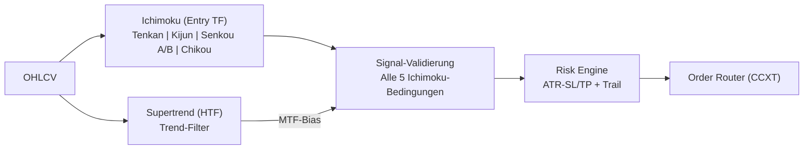

# 🚀 UTBot2 - Universal Trading Bot v2

<div align="center">


[](https://www.python.org/)
[](https://github.com/ccxt/ccxt)
[](https://optuna.org/)
[](LICENSE)

**Ein universeller, flexibler Trading-Bot mit Multi-Asset-Support und fortgeschrittenen Trading-Strategien**

[Features](#-features) • [Installation](#-installation) • [Optimierung](#-optimierung) • [Live-Trading](#-live-trading) • [Monitoring](#-monitoring) • [Wartung](#-wartung)

</div>

---

## 📊 Übersicht

UTBot2 ist die zweite Generation eines universellen Trading-Bots, der für maximale Flexibilität und Anpassungsfähigkeit entwickelt wurde. Das System unterstützt eine Vielzahl von Handelspaaren und Timeframes und kann an verschiedene Marktbedingungen angepasst werden.

### 🧭 Trading-Logik (Kurzfassung)
- **Vollständiger Ichimoku Kinko Hyo**: Alle 5 Komponenten (Tenkan, Kijun, Senkou A/B, Chikou) werden für maximale Signalqualität genutzt.
- **Supertrend MTF-Filter**: Die übergeordnete Timeframe wird via Supertrend-Indikator gefiltert - nur Trades in Richtung des HTF-Trends.
- **Multi-Asset Core**: Parallele Strategien je Symbol/Timeframe mit gemeinsamer Risk-Engine.
- **Risk Layer**: ATR-basiertes SL/TP, optionales Trailing; Position Sizing auf Konto-Risk begrenzt.
- **Optimizer Loop**: Optuna sucht Ichimoku- und Supertrend-Parameter; Ergebnisse landen als Configs pro Symbol.

### 🔍 Strategie-Visualisierung


### 📈 Vollständiges Ichimoku-Signal

**LONG-Bedingungen (alle müssen erfüllt sein):**
1. ✅ Preis über der Kumo (Wolke)
2. ✅ Tenkan-sen > Kijun-sen
3. ✅ Chikou Span über historischem Preis UND historischer Wolke
4. ✅ Zukunftswolke ist bullish (Senkou A > Senkou B)
5. ✅ Preis über Tenkan-sen (Momentum)
6. ✅ HTF Supertrend ist BULLISH

**SHORT-Bedingungen (alle müssen erfüllt sein):**
1. ✅ Preis unter der Kumo (Wolke)
2. ✅ Tenkan-sen < Kijun-sen
3. ✅ Chikou Span unter historischem Preis UND historischer Wolke
4. ✅ Zukunftswolke ist bearish (Senkou A < Senkou B)
5. ✅ Preis unter Tenkan-sen (Momentum)
6. ✅ HTF Supertrend ist BEARISH

### 📊 Trade-Beispiel (TP/SL/Trailing)
- **Setup**: Alle 5 Ichimoku-Bedingungen bullish + HTF Supertrend grün → Long-Signal
- **Entry**: Bei Signalbestätigung zum Close-Preis
- **Initial SL**: ATR-Multiplikator × ATR unter Entry (mindestens 0.5%)
- **TP**: SL-Distanz × Risk-Reward-Ratio
- **Trailing**: Nach Erreichen des Activation-RR wird der SL nachgezogen

### 🏗️ Architektur
```
Entry-TF OHLCV → Ichimoku Engine → Signal-Validierung ─┐
                                                       ├→ Risk Engine → CCXT Orders
HTF OHLCV ──────→ Supertrend Engine → MTF-Bias ───────┘
                        ↘ Optuna (Parameter) ↗
```

### 🎯 Hauptmerkmale

- **🌐 Universal**: Funktioniert mit verschiedenen Kryptowährungen und Strategien
- **📈 Multi-Asset**: Handel von 7+ Assets gleichzeitig
- **🔧 Highly Configurable**: Einfach anpassbare Parameter
- **💰 Flexible Timeframes**: Von 15m bis 1d
- **⚡ Optimized Performance**: Schnelle Ausführung und niedrige Latenz
- **📊 Advanced Analytics**: Umfassende Performance-Analysen
- **🛡️ Risk Management**: Intelligentes Risikomanagement
- **🔔 Notifications**: Real-time Updates via Telegram (optional)

---

## 🚀 Features

### Trading Features
- ✅ 7+ Kryptowährungspaare (BTC, ETH, SOL, DOGE, XRP, ADA, AAVE)
- ✅ Multiple Timeframes (15m, 30m, 1h, 6h, 1d)
- ✅ Vollständiger Ichimoku Kinko Hyo (alle 5 Komponenten)
- ✅ Supertrend Multi-Timeframe Filter
- ✅ Dynamisches Position Sizing
- ✅ ATR-basiertes Stop-Loss und Take-Profit
- ✅ Trailing Stop Management
- ✅ Automatische Trade-Verwaltung

### Technical Features
- ✅ Optuna Hyperparameter-Optimierung
- ✅ Ichimoku Cloud Indikatoren (Tenkan, Kijun, Senkou A/B, Chikou)
- ✅ Supertrend Indikator für MTF-Filtering
- ✅ ATR für dynamisches Risk Management
- ✅ Backtesting mit realistischer Simulation
- ✅ Performance-Tracking und Reporting

---

## 📋 Systemanforderungen

### Hardware
- **CPU**: Multi-Core Prozessor empfohlen
- **RAM**: Minimum 4GB, empfohlen 8GB+
- **Speicher**: 2GB freier Speicherplatz

### Software
- **OS**: Linux (Ubuntu 20.04+), macOS, Windows 10/11
- **Python**: Version 3.8 oder höher
- **Git**: Für Repository-Verwaltung

---

## 💻 Installation

### 1. Repository klonen

```bash
git clone https://github.com/Youra82/utbot2.git
cd utbot2
```

### 2. Automatische Installation

```bash
# Linux/macOS
chmod +x install.sh
./install.sh

# Windows (PowerShell)
python -m venv .venv
.venv\Scripts\activate
pip install -r requirements.txt
```

Das Installations-Script:
- ✅ Erstellt virtuelle Python-Umgebung
- ✅ Installiert alle Dependencies
- ✅ Erstellt Verzeichnisstruktur
- ✅ Initialisiert Konfigurationen

### 3. API-Credentials konfigurieren

Erstelle `secret.json`:

```json
{
  "utbot2": [
    {
      "name": "Binance Main Account",
      "exchange": "binance",
      "apiKey": "DEIN_API_KEY",
      "secret": "DEIN_SECRET_KEY",
      "options": {
        "defaultType": "future"
      }
    }
  ]
}
```

⚠️ **Sicherheit**:
- Niemals `secret.json` committen!
- Nur API-Keys ohne Withdrawal-Rechte verwenden
- IP-Whitelist aktivieren
- 2-Faktor-Authentifizierung aktivieren

### 4. Trading-Strategien konfigurieren

Bearbeite `settings.json`:

```json
{
  "live_trading_settings": {
    "use_auto_optimizer_results": false,
    "active_strategies": [
      {
        "symbol": "BTC/USDT:USDT",
        "timeframe": "1h",
        "active": true
      },
      {
        "symbol": "ETH/USDT:USDT",
        "timeframe": "4h",
        "active": true
      },
      {
        "symbol": "SOL/USDT:USDT",
        "timeframe": "1h",
        "active": true
      }
    ]
  }
}
```

**Parameter-Erklärung**:
- `symbol`: Handelspaar (Format: BASE/QUOTE:SETTLE)
- `timeframe`: Zeitrahmen (15m, 30m, 1h, 2h, 4h, 6h, 1d)
- `active`: Strategie aktivieren/deaktivieren (true/false)

**HTF-Mapping** (automatisch):
| Entry-TF | HTF (Supertrend) |
|----------|------------------|
| 5m, 15m  | 1h               |
| 30m, 1h  | 4h               |
| 2h, 4h   | 1d               |
| 6h, 1d   | 1d               |

---

## 🎯 Optimierung & Training

### Vollständige Pipeline (Empfohlen)

```bash
./run_pipeline.sh
```

Pipeline-Schritte:
1. **Aufräumen** (Optional): Alte Configs löschen
2. **Symbol-Auswahl**: Handelspaare interaktiv wählen
3. **Timeframe-Auswahl**: Zeitrahmen für jedes Paar konfigurieren
4. **Daten-Download**: Historische Marktdaten laden
5. **Optimierung**: Parameter mit Optuna optimieren
6. **Backtest**: Strategien auf historischen Daten validieren
7. **Config-Generierung**: Configs für Live-Trading erstellen

### Manuelle Optimierung

```bash
source .venv/bin/activate
python src/utbot2/analysis/optimizer.py
```

**Erweiterte Optionen**:
```bash
# Spezifische Symbole optimieren
python src/utbot2/analysis/optimizer.py --symbols BTC ETH SOL

# Custom Timeframes
python src/utbot2/analysis/optimizer.py --timeframes 30m 1h 6h

# Mehr Optimierungs-Trials (bessere Ergebnisse)
python src/utbot2/analysis/optimizer.py --trials 400

# Walk-Forward Analyse
python src/utbot2/analysis/optimizer.py --walk-forward
```

**Optimierte Parameter**:
- Ichimoku-Perioden (Tenkan, Kijun, Senkou Span B)
- Supertrend ATR-Periode und Multiplikator
- Stop-Loss/Take-Profit Levels (ATR-basiert)
- Trailing Stop Activation und Callback-Rate
- Risk-Management-Parameter (Leverage, Risk-per-Trade)

---

## 🔴 Live Trading

### Start des Live-Trading

```bash
# Master Runner starten (alle aktiven Strategien)
python master_runner.py
```

### Manuell starten / Cronjob testen
Direkt ausführen, ohne auf den nächsten Cron-Lauf zu warten:

```bash
cd /home/ubuntu/utbot2 && /home/ubuntu/utbot2/.venv/bin/python3 /home/ubuntu/utbot2/master_runner.py
```

Der Master Runner:
- ✅ Lädt alle aktiven Strategien aus `settings.json`
- ✅ Startet separate Prozesse für jedes Handelspaar
- ✅ Überwacht Kontostand und verfügbares Kapital
- ✅ Verwaltet Positionen und Orders
- ✅ Führt detailliertes Logging durch

### Automatischer Start

```bash
# Optimierung + Live-Trading
./run_pipeline_automated.sh
```

### Als Systemd Service (Linux)

Für 24/7 Betrieb:

```bash
sudo nano /etc/systemd/system/utbot2.service
```

```ini
[Unit]
Description=UTBot2 Trading System
After=network.target

[Service]
Type=simple
User=your-user
WorkingDirectory=/path/to/utbot2
ExecStart=/path/to/utbot2/.venv/bin/python master_runner.py
Restart=always
RestartSec=10
Environment="PYTHONUNBUFFERED=1"

[Install]
WantedBy=multi-user.target
```

```bash
# Service aktivieren und starten
sudo systemctl enable utbot2
sudo systemctl start utbot2

# Status prüfen
sudo systemctl status utbot2

# Logs verfolgen
sudo journalctl -u utbot2 -f
```

---

## 📊 Monitoring & Status

### Status-Dashboard

```bash
# Vollständiger Status
./show_status.sh
```

Zeigt:
- 📊 Aktuelle Konfiguration
- 📈 Offene Positionen
- 💰 Kontostand
- 📝 Recent Logs

### Performance-Monitoring

```bash
# Ergebnisse anzeigen
./show_results.sh

# Charts generieren
./show_chart.sh

# Chart per Telegram senden (falls konfiguriert)
python generate_and_send_chart.py
```

### Log-Files überwachen

```bash
# Live-Trading Logs (alle Strategien)
tail -f logs/live_trading_*.log

# Spezifisches Symbol
tail -f logs/live_trading_BTC_USDT_15m.log

# Nur Trade-Signale
grep -i "signal\|buy\|sell\|opened\|closed" logs/live_trading_*.log

# Fehler-Logs
tail -f logs/error_*.log

# Profit-Zusammenfassung
grep "Profit:" logs/*.log | awk '{sum+=$NF} END {print "Total:", sum}'
```

### Performance-Analyse

```bash
# Equity-Curves vergleichen
python -c "
import pandas as pd
manual = pd.read_csv('manual_portfolio_equity.csv')
optimal = pd.read_csv('optimal_portfolio_equity.csv')
print('Manual Return:', (manual['equity'].iloc[-1] / manual['equity'].iloc[0] - 1) * 100, '%')
print('Optimal Return:', (optimal['equity'].iloc[-1] / optimal['equity'].iloc[0] - 1) * 100, '%')
"

# Trade-Statistiken
python -c "
import pandas as pd
try:
    trades = pd.read_csv('logs/trades_history.csv')
    print('Total Trades:', len(trades))
    print('Win Rate:', (trades['pnl'] > 0).mean() * 100, '%')
    print('Average PnL:', trades['pnl'].mean())
    print('Best Trade:', trades['pnl'].max())
    print('Worst Trade:', trades['pnl'].min())
except:
    print('No trade history found yet')
"
```

---

## 🛠️ Wartung & Pflege

### Regelmäßige Wartung

#### 1. Updates installieren

```bash
# Automatisches Update-Script
./update.sh
```

Das Update-Script:
- ✅ Pulled neueste Änderungen von Git
- ✅ Updated Python-Dependencies
- ✅ Migriert Konfigurationen
- ✅ Führt Tests aus

#### 2. Log-Rotation

```bash
# Alte Logs komprimieren (älter als 30 Tage)
find logs/ -name "*.log" -type f -mtime +30 -exec gzip {} \;

# Archivierte Logs löschen (älter als 90 Tage)
find logs/ -name "*.log.gz" -type f -mtime +90 -delete

# Log-Größe prüfen
du -sh logs/
```

#### 3. Performance-Check

```bash
# Regelmäßige Performance-Prüfung
python -c "
import pandas as pd
from datetime import datetime, timedelta

try:
    trades = pd.read_csv('logs/trades_history.csv')
    trades['date'] = pd.to_datetime(trades['timestamp'])
    week_ago = datetime.now() - timedelta(days=7)
    recent = trades[trades['date'] > week_ago]
    
    print('=== Last 7 Days Performance ===')
    print('Total Trades:', len(recent))
    print('Win Rate:', (recent['pnl'] > 0).mean() * 100, '%')
    print('Total PnL:', recent['pnl'].sum())
except:
    print('No trade data available')
"
```

### Vollständiges Aufräumen

#### Konfigurationen zurücksetzen

```bash
# Generierte Configs löschen
rm -f src/utbot2/strategy/configs/config_*.json

# Prüfen
ls -la src/utbot2/strategy/configs/

# Optimierungsergebnisse löschen
rm -rf artifacts/results/*

# Verification
ls -la artifacts/results/
```

#### Cache und Daten löschen

```bash
# Heruntergeladene Marktdaten
rm -rf data/raw/*
rm -rf data/processed/*

# Backtest-Cache
rm -rf data/backtest_cache/*

# Größe prüfen
du -sh data/*
```

#### Kompletter Neustart

```bash
# Vollständiges Backup erstellen
tar -czf utbot2_backup_$(date +%Y%m%d_%H%M%S).tar.gz \
    secret.json settings.json artifacts/ logs/

# Alles zurücksetzen
rm -rf artifacts/* data/* logs/*
mkdir -p artifacts/{results,backtest} data/{raw,processed} logs/

# Re-Installation
./install.sh

# Konfiguration wiederherstellen
cp settings.json.backup settings.json

# Verification
ls -R artifacts/ data/ logs/ | wc -l
```

### Tests ausführen

```bash
# Alle Tests
./run_tests.sh

# Spezifische Tests
pytest tests/test_strategy.py -v
pytest tests/test_exchange.py -v

# Mit Coverage
pytest --cov=src tests/

# Coverage-Report generieren
pytest --cov=src --cov-report=html tests/
```

### API-Account prüfen

```bash
# Account-Type und Permissions prüfen
python check_account_type.py

# API-Verbindung testen
python test_api.py
```

---

## 🔧 Nützliche Befehle

### Konfiguration

```bash
# Settings validieren
python -c "import json; print(json.load(open('settings.json')))"

# Aktive Strategien auflisten
python -c "
import json
settings = json.load(open('settings.json'))
for strat in settings['live_trading_settings']['active_strategies']:
    if strat['active']:
        print(f\"{strat['symbol']} @ {strat['timeframe']}\")
"

# Backup mit Timestamp
cp settings.json settings.json.backup.$(date +%Y%m%d_%H%M%S)

# Diff zwischen Versionen
diff settings.json settings.json.backup
```

### Prozess-Management

```bash
# Alle UTBot2-Prozesse
ps aux | grep python | grep utbot2

# Master Runner PID
pgrep -f "python.*master_runner"

# Einzelne Strategien
ps aux | grep "run.py"

# Sauber beenden
pkill -f master_runner.py

# Sofort beenden
pkill -9 -f master_runner.py

# Alle UTBot2-Prozesse beenden
pkill -f "utbot2"
```

### Exchange-Diagnose

```bash
# Verbindung testen
python -c "from src.utbot2.utils.exchange import Exchange; \
    e = Exchange('binance'); print('Connected')"

# Balance abrufen
python -c "from src.utbot2.utils.exchange import Exchange; \
    e = Exchange('binance'); balance = e.fetch_balance(); \
    print('Total USDT:', balance['USDT']['total'])"

# Offene Positionen
python -c "from src.utbot2.utils.exchange import Exchange; \
    e = Exchange('binance'); \
    positions = [p for p in e.fetch_positions() if float(p['contracts']) != 0]; \
    print('Open Positions:', len(positions)); \
    for p in positions: print(f\"{p['symbol']}: {p['contracts']} contracts\")"

# Marktdaten testen
python -c "from src.utbot2.utils.exchange import Exchange; \
    e = Exchange('binance'); \
    ohlcv = e.fetch_ohlcv('BTC/USDT:USDT', '1h', limit=10); \
    print('Fetched', len(ohlcv), 'candles successfully')"
```

### Debugging

```bash
# Debug-Modus aktivieren
export UTBOT2_DEBUG=1
export PYTHONUNBUFFERED=1
python master_runner.py

# Nur Strategie-Logs anzeigen
tail -f logs/live_trading_*.log | grep --color=auto -i "signal\|trade"

# Mit Python Debugger
python -m pdb master_runner.py

# Interactive Shell mit Bot-Kontext
python -i -c "
from src.utbot2.utils.exchange import Exchange
exchange = Exchange('binance')
print('Exchange loaded. Use exchange.* methods')
"
```

---

## 📂 Projekt-Struktur

```
utbot2/
├── src/utbot2/
│   ├── analysis/              # Optimierung & Analyse
│   │   └── optimizer.py
│   ├── strategy/              # Trading-Strategien
│   │   ├── run.py             # Main Strategy Runner
│   │   └── configs/           # Generierte Configs
│   ├── backtest/              # Backtesting
│   │   └── backtester.py
│   └── utils/                 # Utilities
│       ├── exchange.py        # Exchange-Wrapper
│       └── indicators.py      # Technical Indicators
├── tests/                     # Unit-Tests
├── data/                      # Marktdaten
│   ├── raw/
│   └── processed/
├── logs/                      # Log-Files
├── artifacts/                 # Ergebnisse
│   ├── results/
│   └── backtest/
├── master_runner.py          # Main Entry-Point
├── settings.json             # Konfiguration
├── secret.json               # API-Credentials
└── requirements.txt          # Dependencies
```

---

## ⚠️ Wichtige Hinweise

### Risiko-Disclaimer

⚠️ **Kryptowährungs-Trading ist hochriskant!**

- Nur Kapital einsetzen, dessen Verlust Sie verkraften können
- Keine Gewinn-Garantien
- Vergangene Performance ist kein Indikator für zukünftige Ergebnisse
- Umfangreiches Testing auf Demo-Accounts empfohlen
- Mit kleinen Beträgen beginnen und skalieren

### Security Best Practices

- 🔐 **Niemals** API-Keys mit Withdrawal-Rechten verwenden
- 🔐 IP-Whitelist auf Exchange aktivieren
- 🔐 2-Faktor-Authentifizierung für Exchange-Account
- 🔐 `secret.json` in `.gitignore` eintragen
- 🔐 Regelmäßige Security-Updates durchführen
- 🔐 Logs auf ungewöhnliche Aktivitäten prüfen

### Performance-Tipps

- 💡 Starten Sie mit 2-3 unkorrelierten Assets
- 💡 Mischen Sie verschiedene Timeframes
- 💡 Längere Timeframes (6h, 1d) = Stabilere Signale, weniger Trades
- 💡 Kürzere Timeframes (15m, 30m) = Mehr Trades, höheres Risiko
- 💡 HTF Supertrend filtert gegen den übergeordneten Trend
- 💡 Re-Optimierung alle 3-4 Wochen empfohlen
- 💡 Tägliches Monitoring ist essentiell

---

## 🤝 Support & Community

### Probleme melden

Bei Problemen oder Fragen:

1. **Logs prüfen**: `logs/` Verzeichnis
2. **Tests ausführen**: `./run_tests.sh`
3. **GitHub Issue** erstellen mit:
   - Detaillierte Problembeschreibung
   - Relevante Log-Auszüge
   - System-Informationen (OS, Python-Version)
   - Reproduktions-Schritte

### Updates erhalten

```bash
# Regelmäßig Updates prüfen
git fetch origin
git log HEAD..origin/main --oneline

# Updates installieren
./update.sh
```

### Optimierte Konfigurationen auf Repo hochladen

Nach erfolgreicher Parameter-Optimierung können die Konfigurationsdateien auf das Repository hochgeladen werden:

```bash
# Konfigurationsdateien auf Repository hochladen
git add src/utbot2/strategy/configs/*.json
git commit -m "Update: Optimierte Strategie-Konfigurationen"
git push origin main --force
```

Dies sichert:
- ✅ **Backup** der optimierten Parameter
- ✅ **Versionierung** aller Konfigurationsänderungen
- ✅ **Deployment** auf mehrere Server mit konsistenten Einstellungen
- ✅ **Nachvollziehbarkeit** welche Parameter zu welchem Zeitpunkt verwendet wurden

---

## 📜 Lizenz

Dieses Projekt ist lizenziert unter der MIT License - siehe [LICENSE](LICENSE) Datei für Details.

---

## 🙏 Credits

Entwickelt mit:
- [CCXT](https://github.com/ccxt/ccxt) - Cryptocurrency Exchange Trading Library
- [Optuna](https://optuna.org/) - Hyperparameter Optimization Framework
- [Pandas](https://pandas.pydata.org/) - Data Analysis Library
- [NumPy](https://numpy.org/) - Numerical Computing
- [SciPy](https://scipy.org/) - Scientific Computing

---

<div align="center">

**Made with ❤️ for Universal Algorithmic Trading**

⭐ Star this repo if you find it useful!

[🔝 Nach oben](#-utbot2---universal-trading-bot-v2)

</div>

---

## 🛠️ Git: Änderungen mit force push übertragen

Falls du Änderungen (z.B. Bugfixes oder neue Features) direkt und ohne Rücksicht auf den Remote-Stand pushen willst, kannst du einen Force-Push verwenden. **Achtung:** Dies überschreibt den Remote-Branch und sollte nur verwendet werden, wenn du sicher bist, dass keine wichtigen Änderungen verloren gehen!

```bash
git add .
git commit -m "Dein Commit-Text"
git push --force
```

**Hinweis:** Die Datei `secret.json` solltest du vor dem Push bereinigen oder aus dem Commit entfernen, um sensible Daten zu schützen.
